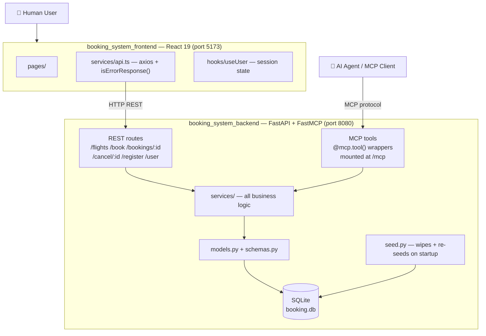
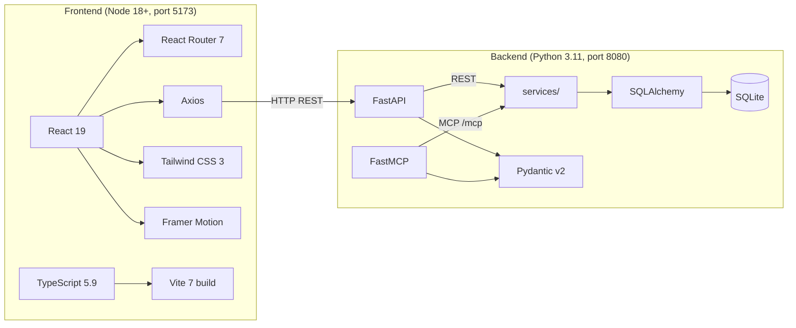
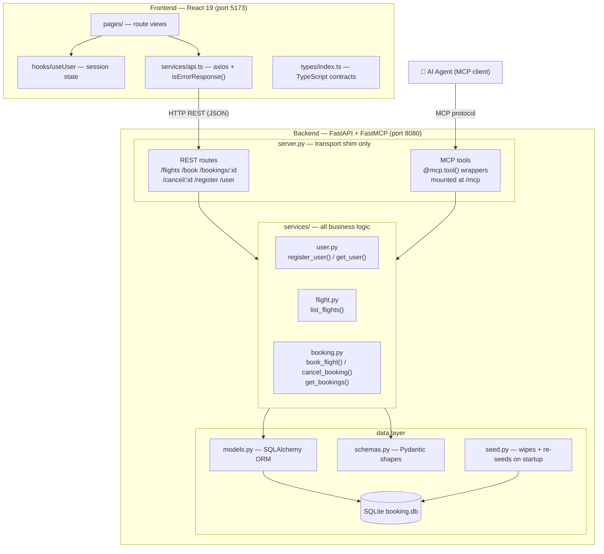
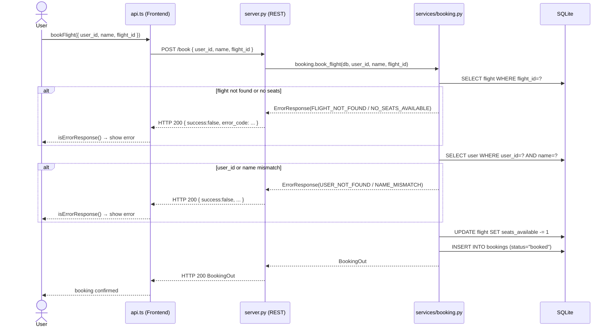
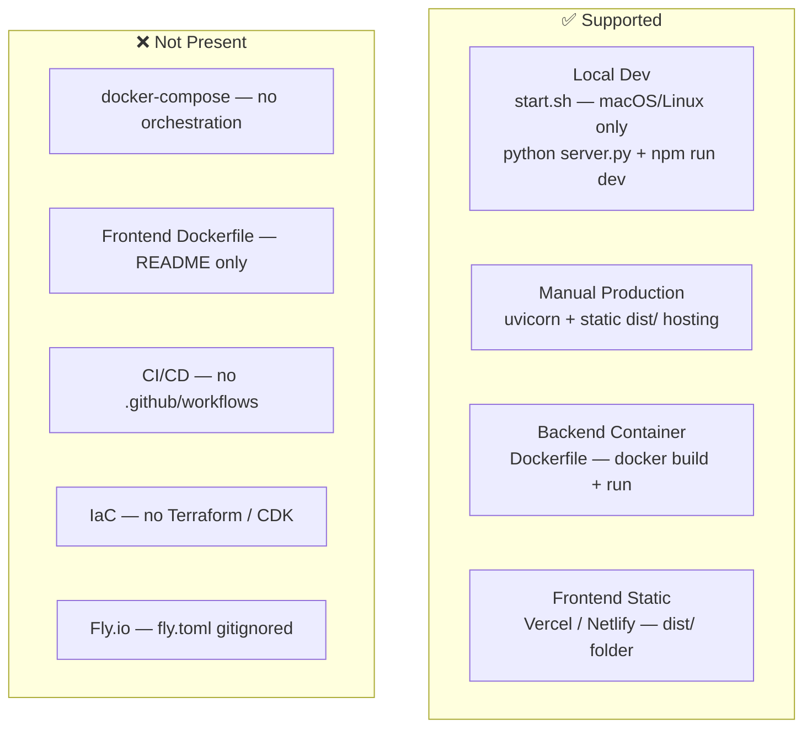

# Galaxium Travels — Developer Onboarding

> A concise technical reference for engineers joining this codebase.
> Covers architecture, stack, components, testing, and deployment.

---

## Table of Contents

1. [Application Overview](#1-application-overview)
2. [Tech Stack](#2-tech-stack)
3. [Key Components and Interactions](#3-key-components-and-interactions)
4. [Unit Test Coverage](#4-unit-test-coverage)
5. [End-to-End Test Coverage](#5-end-to-end-test-coverage)
6. [Deployment Model](#6-deployment-model)

---

## 1. Application Overview

### Purpose

**Galaxium Travels** is a fictional interplanetary space-flight booking system. Users can browse flights between planets (Earth, Mars, Moon, Venus, Jupiter, etc.), register an account, book seats, and manage reservations.

Its standout design goal is a **dual-protocol backend**: the same business logic is exposed over both a standard REST API and the **Model Context Protocol (MCP)**, making it usable by both human-facing frontends and AI agents simultaneously.

### Project Structure

```
galaxium-travels/
├── booking_system_backend/       # Python FastAPI + FastMCP server (port 8080)
│   ├── server.py                 # Transport shim — REST routes + MCP tools
│   ├── db.py                     # SQLAlchemy engine + SessionLocal factory
│   ├── models.py                 # SQLAlchemy ORM table definitions
│   ├── schemas.py                # Pydantic v2 request/response shapes
│   ├── seed.py                   # Demo data — wipes + re-seeds on every startup
│   ├── services/                 # All business logic
│   │   ├── user.py               # register_user(), get_user()
│   │   ├── flight.py             # list_flights()
│   │   └── booking.py            # book_flight(), cancel_booking(), get_bookings()
│   ├── tests/                    # pytest suite (in-memory SQLite)
│   ├── requirements.txt
│   └── Dockerfile
│
├── booking_system_frontend/      # React 19 + TypeScript + Vite (port 5173)
│   └── src/
│       ├── components/           # Reusable UI elements
│       ├── pages/                # Route-level views
│       ├── hooks/                # UserProvider context — global session state
│       ├── services/api.ts       # Axios instance + isErrorResponse() helper
│       ├── types/                # TypeScript types mirroring backend schemas
│       └── utils/                # Shared utility functions
│
├── docs/                         # Project documentation
├── start.sh                      # One-command local startup (macOS/Linux)
└── AGENTS.md                     # AI agent context file
```

### High-Level Architecture



### Top-Level Directory Responsibilities

| Directory | Responsibility |
|---|---|
| `booking_system_backend/` | Entire server — REST API, MCP tools, database, business logic, tests |
| `booking_system_frontend/` | React web app — space-themed UI for human users |
| `docs/` | Project documentation |
| `start.sh` | One-command local dev startup (macOS/Linux only) |
| `AGENTS.md` | AI agent context — loaded by AI coding assistants |

---

## 2. Tech Stack

### Backend — `booking_system_backend/`

| Category | Detail |
|---|---|
| **Language** | Python |
| **Runtime** | Python 3.11 (pinned in `Dockerfile`); minimum 3.8+ |
| **Web Framework** | FastAPI — async ASGI framework |
| **MCP Layer** | FastMCP — exposes business logic as MCP tools for AI agents |
| **ASGI Server** | Uvicorn |
| **ORM** | SQLAlchemy |
| **Database** | SQLite (`booking.db`) — file-based, wiped and re-seeded on every start |
| **Validation** | Pydantic v2 with email extension |
| **Config** | python-dotenv |
| **Test Runner** | pytest |
| **Async Testing** | pytest-asyncio |
| **Coverage** | pytest-cov |
| **HTTP Test Client** | httpx (used by FastAPI's `TestClient`) |
| **Containerisation** | Docker — `python:3.11-slim` base image |

### Frontend — `booking_system_frontend/`

| Category | Detail |
|---|---|
| **Language** | TypeScript 5.9 |
| **Runtime** | Node.js 18+ |
| **JS Target** | ES2022 |
| **UI Framework** | React 19.2 |
| **Build Tool** | Vite 7.2 |
| **CSS Framework** | Tailwind CSS 3.4 |
| **HTTP Client** | Axios 1.13 |
| **Routing** | React Router DOM 7.12 |
| **Animations** | Framer Motion 12.26 |
| **Icons** | Lucide React |
| **Notifications** | React Hot Toast |
| **Date Utilities** | date-fns 4.1 |
| **CSS Utilities** | clsx 2.1 — conditional class merging |
| **Linter** | ESLint 9 + typescript-eslint + react-hooks + react-refresh |
| **TypeScript Config** | Strict mode, `verbatimModuleSyntax`, `noUnusedLocals`, `noUnusedParameters` all on |
| **Test Framework** | ❌ None configured |

### Stack at a Glance



### Key Design Observations

- **No frontend test framework** — the backend has a full pytest suite; the frontend has zero test infrastructure.
- **No pinned backend versions** — `requirements.txt` uses bare package names (e.g. `fastapi`, not `fastapi==x.y.z`). Builds are not reproducible without a lockfile.
- **SQLite is non-persistent by design** — `seed()` destroys all data on every restart. This is a demo/dev choice.
- **TypeScript strict mode fully enabled** — `noUnusedLocals`, `noUnusedParameters`, `verbatimModuleSyntax`, and `erasableSyntaxOnly` are all active.

---

## 3. Key Components and Interactions

### Component Responsibilities

#### `src/services/api.ts` — Frontend API Layer

The single point of contact between the React app and the backend:

- Holds the axios instance configured via `VITE_API_URL` env var (defaults to `http://localhost:8080`)
- Exports one typed function per endpoint: `getFlights`, `registerUser`, `getUserByCredentials`, `bookFlight`, `getUserBookings`, `cancelBooking`
- Exports `isErrorResponse()` — discriminates `T | ErrorResponse` unions by checking `response.success === false`
- Response interceptor normalises network errors into the same `ErrorResponse` shape

#### `server.py` — Transport Shim

Contains **no business logic**:

- `mcp = FastMCP(...)` and `mcp_app = mcp.http_app()` must be created **before** `app = FastAPI(...)` — mandatory for combined lifespan
- Each `@mcp.tool()` wraps the same service function as its REST counterpart, but converts `ErrorResponse` returns into `raise Exception(...)`
- REST endpoints use `Depends(get_db)` (request-scoped); MCP tools call `SessionLocal()` directly (not request-scoped)
- CORS is wide-open: `allow_origins=["*"]`
- MCP app mounted at `/mcp`

#### `services/` — All Business Logic

| Service | Functions | Key Behaviour |
|---|---|---|
| `user.py` | `register_user()`, `get_user()` | Deduplicates by email; `get_user` requires both name + email to match |
| `flight.py` | `list_flights()` | Read-only; returns all flights regardless of seat count |
| `booking.py` | `book_flight()`, `cancel_booking()`, `get_bookings()` | `book_flight` validates: flight exists → seats > 0 → user_id + **name** both match; mutates `seats_available` in the same transaction |

#### `models.py` — ORM Schema

| Table | Key Columns | Notes |
|---|---|---|
| `users` | `user_id`, `name`, `email` (unique) | No password — identity is name+email pair |
| `flights` | `flight_id`, `origin`, `destination`, `departure_time`, `arrival_time`, `price`, `seats_available` | Times stored as **strings**, not datetime columns |
| `bookings` | `booking_id`, `user_id` (FK), `flight_id` (FK), `status`, `booking_time` | No ORM `relationship()` defined — FK columns only |

#### `schemas.py` — Wire Contract

- `ErrorResponse` has `success: bool = False`, `error`, `error_code`, `details` — the `success` field is what `isErrorResponse()` on the frontend discriminates on
- `BookingRequest` requires `user_id + name + flight_id` — `name` must match the registered user's name exactly

### Component Interaction Map



### Booking Lifecycle Data Flow



### Cross-Service Contracts

| Contract | Detail |
|---|---|
| **Error shape** | All failures return `{ success: false, error, error_code, details }` at **HTTP 200**, never 4xx. Changing to 4xx breaks `isErrorResponse()` on the frontend and MCP tool error parsing. |
| **`book_flight` dual identity check** | `booking.py` filters `user_id AND name` — passing only `user_id` always fails. Both the frontend and all MCP callers must supply `name`. |
| **`seats_available` mutation** | Seat decrement/increment happens in the **same DB transaction** as the booking insert/status update. Splitting these into two commits risks seat count drift. |
| **MCP init order** | `mcp = FastMCP(...)` and `mcp_app = mcp.http_app()` must appear **before** `app = FastAPI(...)` in `server.py`. Reordering breaks the combined lifespan. |
| **DB session strategy** | REST → `Depends(get_db)` (request-scoped). MCP tools → `SessionLocal()` manually. Mixing these causes session leaks. |
| **No ORM relationships** | `Booking` has FK columns but no `relationship()`. All joins require explicit queries. |
| **Datetime as string** | `departure_time`, `arrival_time`, `booking_time` are `String` columns with ISO 8601 values. Sorting/comparing requires string-aware handling. |
| **`seed()` destroys all data** | Every server restart wipes `booking.db`. Data is non-persistent by design. |

---

## 4. Unit Test Coverage

### Test Infrastructure (`conftest.py`)

| Property | Detail |
|---|---|
| **Isolation** | `scope="function"` — full `create_all` + `drop_all` per test; zero state leaks between tests |
| **Database** | In-memory SQLite with `StaticPool` — same connection reused across schema creation and session |
| **Seed bypassed** | `server.seed` patched to `lambda: None` — tests start with an empty DB |
| **Dual session patching** | Both `db.SessionLocal` and `server.SessionLocal` are patched to route MCP tool DB calls to the test session |
| **FastAPI DI override** | `get_db` overridden via `dependency_overrides` — REST endpoints also use the test session |
| **Unused fixtures** | `sample_flight_data` and `sample_booking_data` are defined in `conftest.py` but never used in any test |

### `test_services.py` — Service Layer Tests (16 tests)

Call service functions directly with `db_session`, bypassing HTTP.

| Class | Test | Asserts |
|---|---|---|
| `TestFlightService` | `test_list_flights_empty` | Returns `[]` on empty DB |
| | `test_list_flights_with_data` | Returns correct `origin` / `destination` |
| `TestUserService` | `test_register_user_success` | Returns `UserOut` with `user_id > 0` |
| | `test_register_user_duplicate_email` | Returns `ErrorResponse(error_code="EMAIL_EXISTS")` |
| | `test_get_user_success` | Returns `UserOut` for name+email match |
| | `test_get_user_not_found` | Returns `ErrorResponse(error_code="USER_NOT_FOUND")` |
| `TestBookingService` | `test_book_flight_success` | `status="booked"`; **`seats_available` decremented** |
| | `test_book_flight_not_found` | `error_code="FLIGHT_NOT_FOUND"` |
| | `test_book_flight_no_seats` | `error_code="NO_SEATS_AVAILABLE"` |
| | `test_book_flight_user_not_found` | `error_code="USER_NOT_FOUND"` |
| | `test_book_flight_name_mismatch` | `error_code="NAME_MISMATCH"` |
| | `test_cancel_booking_success` | `status="cancelled"`; **seat restored** |
| | `test_cancel_booking_not_found` | `error_code="BOOKING_NOT_FOUND"` |
| | `test_cancel_booking_already_cancelled` | `error_code="ALREADY_CANCELLED"` |
| | `test_get_bookings_success` | Returns list with correct `status` |
| | `test_get_bookings_empty` | Returns `[]` |

### `test_rest.py` — HTTP Boundary Tests (14 tests)

Go through `TestClient(server.app)` — full FastAPI routing and JSON serialisation exercised.

| Class | Test | Boundary Assertions |
|---|---|---|
| `TestHealthEndpoint` | `test_health_check` | `GET /` → `200 { status: "OK" }` |
| `TestFlightsEndpoint` | `test_get_flights_empty` | `GET /flights` → `200 []` |
| | `test_get_flights_with_data` | `GET /flights` → `200 [{ origin, destination }]` |
| `TestRegisterEndpoint` | `test_register_success` | `POST /register` → `200 { name, email, user_id }` |
| | `test_register_duplicate_email` | `POST /register` → **`200`** `{ success: false, error_code: "EMAIL_EXISTS" }` |
| `TestUserEndpoint` | `test_get_user_success` | `GET /user?name=&email=` → `200 { name }` |
| | `test_get_user_not_found` | `GET /user` → `200 { success: false, error_code: "USER_NOT_FOUND" }` |
| `TestBookEndpoint` | `test_book_flight_success` | `POST /book` → `200 { status: "booked", user_id }` |
| | `test_book_flight_not_found` | `POST /book` → `200 { success: false, error_code: "FLIGHT_NOT_FOUND" }` |
| `TestBookingsEndpoint` | `test_get_bookings_success` | `GET /bookings/{id}` → `200 [{ status: "booked" }]` |
| | `test_get_bookings_empty` | `GET /bookings/999` → `200 []` |
| `TestCancelEndpoint` | `test_cancel_booking_success` | `POST /cancel/{id}` → `200 { status: "cancelled" }` |
| | `test_cancel_booking_not_found` | `POST /cancel/999` → `200 { success: false, error_code: "BOOKING_NOT_FOUND" }` |
| `TestHealthEndpoint` | `test_health_check` | `GET /` → `200 { status: "OK" }` |

### Running the Suite

```bash
# Must be run from booking_system_backend/
cd booking_system_backend
pytest                          # all 30 tests
pytest tests/test_services.py  # 16 service-layer tests
pytest tests/test_rest.py      # 14 HTTP boundary tests
```

No running server required — `TestClient` runs the ASGI app in-process.

### Coverage Gaps

| Gap | Risk | Detail |
|---|---|---|
| **MCP tool wrappers** | High | `@mcp.tool()` wrappers have different error-handling logic (`raise Exception` vs `return ErrorResponse`). Neither path is tested. |
| **No frontend tests** | High | No test framework exists. `isErrorResponse()`, `UserProvider`, and all UI flows are untested. |
| **No full lifecycle test** | Medium | No single test chains register → book → get bookings → cancel. Cross-step state corruption would not be caught. |
| **`seed.py` correctness** | Medium | Patched to a no-op in all tests. Breakage only surfaces at runtime. |
| **`cancel_booking` error cases via REST** | Low | `ALREADY_CANCELLED` is tested at service level only, not through the HTTP boundary. |
| **`book_flight` name mismatch via REST** | Low | `NAME_MISMATCH` has no REST-level test. |
| **Concurrent seat booking** | Low | No concurrency test — two simultaneous bookings on a 1-seat flight are unverified. |

---

## 5. End-to-End Test Coverage

### Current State: No E2E Tests Exist

There are no Playwright, Cypress, Selenium, or any other browser/UI-level tests in this repository. The frontend has **zero test files** and **no test framework configured**.

```
booking_system_frontend/
└── src/   ← no *.test.ts, no *.spec.ts, no __tests__/
```

The test suite is entirely backend-only. The highest-level tests are the `test_rest.py` HTTP integration tests which use FastAPI's `TestClient` — they test the HTTP boundary in-process but do not spin up a real server, do not test a browser, and do not cover any frontend behaviour.

### What Would Be Required to Add E2E Tests

| Layer | Tooling Required | What to Cover |
|---|---|---|
| **Frontend unit/component** | vitest + React Testing Library | `isErrorResponse()` discriminator, `UserProvider` state, booking form validation |
| **API integration** | pytest (already present) + real uvicorn server | Full lifecycle: register → book → get bookings → cancel across real HTTP |
| **Browser E2E** | Playwright or Cypress | Full UI flows: browse flights, sign in, book, view bookings, cancel |
| **MCP tool testing** | pytest + MCP test client | All `@mcp.tool()` wrappers and their `raise Exception` error paths |

### Flows Not Covered by Any Test

| Flow | Risk |
|---|---|
| Register → book → view → cancel (full lifecycle) | State corruption across steps undetected |
| Frontend error display when API returns `ErrorResponse` | `isErrorResponse()` logic untested |
| MCP tool error propagation | `raise Exception(result.details or result.error)` path never exercised |
| `seed()` data integrity | Wiped to no-op in all tests; only verified at manual runtime |
| Concurrent booking (race condition on `seats_available`) | Unverified |
| Frontend build correctness | `npm run build` is never run in any automated check |

---

## 6. Deployment Model

### Summary: Manual Only

There is no CI/CD pipeline, no infrastructure-as-code, no container orchestration, and no automated deployment. All deployment is manual.

| Artifact | Status |
|---|---|
| `booking_system_backend/Dockerfile` | ✅ Exists and functional |
| `booking_system_frontend/Dockerfile` | ❌ Documented in README only — file not committed |
| `docker-compose.yml` | ❌ Does not exist |
| `.github/workflows/` | ❌ Does not exist |
| Terraform / Pulumi / CDK | ❌ Does not exist |
| `fly.toml` | ❌ Gitignored — was used at some point, no longer committed |

### Deployment Targets



### Backend Dockerfile

```dockerfile
FROM python:3.11-slim       # pinned to 3.11
WORKDIR /app
COPY . .                    # ⚠ no .dockerignore — copies tests/, __pycache__/, booking.db
RUN pip install --no-cache-dir -r requirements.txt
EXPOSE 8080
CMD ["python", "server.py"] # single process — no worker scaling
```

**Gaps:** No `.dockerignore`, no health check instruction, `CMD` uses single-process `python server.py` instead of `uvicorn --workers N`.

### Frontend Dockerfile (documented, not committed)

```dockerfile
FROM node:18-alpine as build
WORKDIR /app
COPY package*.json ./
RUN npm install
COPY . .
RUN npm run build

FROM nginx:alpine
COPY --from=build /app/dist /usr/share/nginx/html
EXPOSE 80
CMD ["nginx", "-g", "daemon off;"]
```

This multi-stage build pattern is correct but exists only as a README code block in `booking_system_frontend/README.md`.

### Local Dev — `start.sh`

Installs dependencies and starts both services in the background. macOS/Linux only (uses `bash`, `source`, and POSIX `kill`).

```
start.sh
├── Check python3 + node installed
├── Create .venv if missing → pip install -r requirements.txt
├── python server.py &  → port 8080
├── sleep 2
├── npm install if node_modules missing
├── npm run dev &  → port 5173
└── wait; trap SIGINT/SIGTERM → kill both
```

### Manual Production Commands

**Backend:**
```bash
cd booking_system_backend
pip install -r requirements.txt
uvicorn server:app --host 0.0.0.0 --port 8080
```

**Frontend:**
```bash
cd booking_system_frontend
npm run build
# Deploy dist/ to Vercel, Netlify, or any static host
```

### Critical Deployment Constraints

| Constraint | Impact |
|---|---|
| **`seed()` runs on every startup** | Every container restart wipes all data. SQLite is not viable as a production database in this model. |
| **SQLite is a local file** | `booking.db` lives inside the container filesystem. Lost on every restart unless a volume is mounted at `/app`. |
| **`VITE_API_URL` baked at build time** | Vite embeds the env var into the static bundle at `npm run build`. You cannot change the API URL post-build — a rebuild is required per environment. |
| **CORS is `allow_origins=["*"]`** | Must be locked down for any production deployment. |
| **No pinned dependency versions** | `requirements.txt` has bare package names. Builds on different dates may produce different results. |
| **No reverse proxy / TLS** | The backend Dockerfile exposes raw uvicorn on 8080 with no TLS termination, rate limiting, or reverse proxy. |

---

*This document was generated from a full codebase analysis. Keep it updated as the project evolves.*
